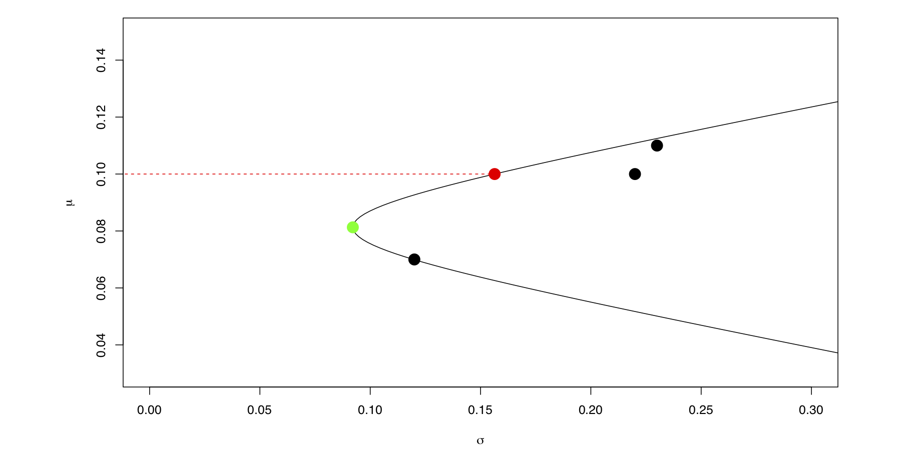

Markowitz introduced the Mean-Variance framework (also called Modern
Portfolio Theory) in his original article [1]. He introduced the process of
selecting an optimal portfolio for an investor by dividing it into two
stages. 

The first stage is concerned about the future performance of the
available financial assets and results in a set of quantified
characteristics about this assets. 

The second stage is concerned about
building an optimized portfolio, this is accomplished by taking the
quantified characteristics of the financial assets in the first stage
and optimizing the portfolio according to some goal function such as the
investors expected utility. 

Markowitz concentrates only on two of these
quantified characteristics of financial assets, namely the expected
value and variance of the portfolio (hence the name Mean/Variance
framework) and argues that the investor desires expected return and does
not desire variance (i.e. uncertainty). 

One could argue the best way to
build a portfolio is by maximizing only the expected (discounted) return
and ignoring the variance, but Markowitz rejects this hypothesis and
argues that this would never imply that there is a diversified portfolio
which is preferable over a expected value optimized portfolio, but
diversification is both observed and sensible, and therefore does not
imply the superiority of diversification and thus must be rejected.

#### Problem formulation

**Asset return** We have a risky financial asset, e.g. a stock share,
index or a bond, which has a market price  $p_t$ at time $t$, for which the financial asset can be bought or sold. We define the (simple/discrete) return for period $t-1$ to $t$ of the asset as the relative change of the price subtracted by 1:

$$
r_t = \frac{p_{t}}{p_{t-1}} - 1
$$


**The portfolio** We have an investable universe of $j = 1..S$ risky financial assets, and an investor chooses a portfolio at time $t$, i.e. allocates his wealth among the $S$ assets, based on the expectations on the unknown and therefore random returns $\boldsymbol{\mathbf{R_{t+1}}} \in \mathbb{R}^S$ for period $t$ to $t+1$. Usually the investors portfolio is expressed in terms of the portfolio weight vector $w \in \mathbb{R}^S$, where $w_j$ is the fraction of the total capital invested in asset $j$ in period $t$ to $t+1$.

**Means and the covariance matrix of returns** As said, in the Mean/Variance framework for choosing a portfolio the investor only takes into account the means $\mu \in \mathbb{R}^S$ of the returns and covariances $\Sigma \in \mathbb{R}^S \times \mathbb{R}^S$ between the returns: 
$$
\mu = \mathbb{E} (\boldsymbol{\mathbf{R_{t+1}}})\\
\Sigma = \text{Cov} (\boldsymbol{\mathbf{R_{t+1}}})
$$
The real $\mu$ and $\Sigma$ are typically unknown. 
One common method to estimate $\mu$ and $\Sigma$ is to use historical return data up to time $t$ and to calculate the maximum likelihood estimations of  $\mu$ and $\Sigma$ based on the historical returns from some period $t-t_{start}$ to $t$. This period $t-t_{start}$ to $t$ is also called the look-back period.

**Means and variance of the portfolio** After obtaining $\mu$ and $\Sigma$, or a proxy thereof, we can calculate the expected return $\mu_P$ and variance of the portfolio $\sigma_P^2$ in terms of the means and the covariance matrix of returns.
$$
\mu_P = w^T \mu\\
\sigma_P^2 = w^T \Sigma w
$$

**Markowitz efficient portfolio** A portfolio $w$ is efficient when it has the lowest variance among all obtainable portfolios for a given $\mu_{\text{target}}$, where $\mu_{\text{target}}$ is the pre-chosen target expected portfolio return (Minimum variance formulation). One additional constraint is that the portfolio must be fully invested, i.e. the portfolio weights must sum to one:
$$
w_{eff} = \argmin_{w} \frac{1}{2} \sigma_P^2\\
= \argmin_{w} \frac{1}{2} w^T \Sigma w\\
\text{s.t. }w^T \mu = \mu_{\text{target}}\\
1^T w = 1
$$

Deriving the analytical solutions for the efficient portfolio problem is straightforward using the method of Lagrange multipliers.

```R
solve.min_var = function(target.mu, mus, cov) {
  ones = rep(1, length(mus))
  cov.inv = solve(cov)
  a = t(ones) %*% cov.inv %*% ones
  b = t(ones) %*% cov.inv %*% mus
  c = t(mus) %*% cov.inv %*% mus
  
  delta = a * c - b^2
  l1 = (c - b * target.mu) / delta
  l2 = (a*target.mu - b) / delta
  
  cov.inv %*% (as.numeric(l1) * ones + as.numeric(l2) * mus)
}

```


Analogue to the efficient portfolio, one can obtain the global minimum variance portfolio $w_{gmv}$, which is the portfolio with the least variance among all obtainable portfolio. The optimization formulation is equivalent to the efficient portfolio formulation, but without the target return constraint. The solution for $w_{gmv}$ is:
$$
w_{gmv} = \frac{\Sigma^{-1} \mathbb{1}}{\mathbb{1}^T \Sigma^{-1} 1}
$$

```R
solve.gmv = function(mus, cov) {
  ones = rep(1, length(mus))
  (solve(cov) %*% ones) / as.numeric(t(ones) %*% solve(cov) %*% ones)
}
```

## An example

We have a hypothetical investable universe of three risky financial assets consisting of two stocks and one bond. We assume the two stocks have yearly expected returns $\mu_1 = 11\%, \mu_2 = 10\%$ and yearly expected volatility of $\sigma_1 = 23\%, \sigma_2 = 22\%$ and a correlation of $\rho_{12} = 0.4$. The bond has a slightly lower yearly return and risk of $\mu_3 = 7\%$ and $\sigma_3 = 12\%$. We assume the bond has a negative correlation to the stocks: $\rho_{13} = -0.2, \rho_{23} = -0.1$.

We can construct the mean vector $\mu$ and covariance matrix $\Sigma$, using the standard deviations $\sigma$ and the correlations $\rho$:

> Given a vector $x \in \mathbb{R}^S$ the $\text{diag}(x)$ function returns a matrix $\in \mathbb{R}^{S \times S}$ with the components of $x$ on the diagonal

$$
\mu = \begin{pmatrix}
  \mu_1\\
  \mu_2\\
  \mu_3\\
 \end{pmatrix} = \begin{pmatrix}
  0.11\\
  0.1\\
  0.07\\
 \end{pmatrix}, \sigma = \begin{pmatrix}
  \sigma_1\\
  \sigma_2\\
  \sigma_3\\
 \end{pmatrix} = \begin{pmatrix}
  0.23\\
  0.22\\
  0.12\\
 \end{pmatrix}\\
\rho = \begin{pmatrix}
  1 & \rho_{12} & \rho_{13}\\
  \rho_{12} & 1 & \rho_{23}\\
  \rho_{13} & \rho_{23} & 1\\
 \end{pmatrix} = \begin{pmatrix}
  1 & 0.4 & -0.2\\
  0.4 & 1 & -0.1\\
  -0.2 & -0.1 & 1\\
 \end{pmatrix}\\
\Sigma = \text{diag}(\sigma) \, \rho \; \text{diag}(\sigma) = \begin{pmatrix}
  0.053 & 0.020 & -0.006 \\ 
  0.020 & 0.048 & -0.003 \\ 
  -0.006 & -0.003 & 0.014 \\ 
  \end{pmatrix}
$$

```R
mus = c(0.11, 0.10, 0.07)
sds = c(0.23, 0.22, 0.12)

corr = matrix(data = c(1,0.4,-0.2, 0.4,1,-0.1, -0.2,-0.1,1), nrow = 3, ncol = 3)

cov = diag(sds) %*% corr %*% diag(sds)
```

We now want to construct an efficient portfolio $w_{eff}$ according to the Mean/Variance framework with a yearly target return of $\mu_{target} = 0.1$. Additionally we calculate the global minimum variance portfolio $w_{gmv}$ using the solutions provided by the Mean/Variance framework. Additionally we calculate the expected means and volatilities of the portfolios:
$$
w_{eff} = \begin{pmatrix}{}
  0.53 \\ 
  0.29 \\ 
  0.18 \\ 
  \end{pmatrix}, \; \mu_{p eff} = \mu_{target} = 0.1,  \; \sigma_{p eff} = 0.156\\
w_{gmv} = \begin{pmatrix}{}
  0.18 \\ 
  0.14 \\ 
  0.68 \\ 
  \end{pmatrix},  \; \mu_{p gmv} = 0.081, \; \sigma_{p gmv} = 0.092
$$

```R
mu.p = function(w, mus) mus %*% w
sd.p = function(w, cov) sqrt(t(w) %*% cov %*% w)

w.opt = solve.min_var(0.1, mus, cov)
w.gmv = solve.gmv(mus, cov)


target.mus = seq(0.01, 0.15, by = 0.001)
ws.efficient = sapply(target.mus, function(target.mu) solve.min_var(target.mu, mus, cov))
mus.efficient = apply(ws.efficient, 2, function(w) mu.p(w, mus))
sds.efficient = apply(ws.efficient, 2, function(w) sd.p(w, cov))
```

We plot the assets, the efficient portfolio, the global minimum variance portfolio and the efficient frontier (representing all obtainable efficient portfolios) in the standard deviation vs. expected return space:


```R
par(mfrow=c(1, 1),
  oma = c(0,0,0.5,0) + 0.1,
  mar = c(4,8,0.5,4) + 0.1)

plot(sds, mus, xlim=c(0, 0.3), ylim=c(0.03, 0.15),xlab=expression(sigma), ylab=expression(mu), pch=19, cex=2)
lines(sds.efficient, mus.efficient)
lines(y = c(0.1, 0.1), x=c(-1, sd.p(w.opt, cov)), lty=2, col='red')
points(sd.p(w.opt, cov), mu.p(w.opt, mus), col='red', pch=19, cex=2)

points(sd.p(w.gmv, cov), mu.p(w.gmv, mus), col='green', pch=19, cex=2)

par(mfrow=c(1, 1))
```


## Appendix: Utility maximization formulation
 
When using the efficient portfolio formulation, one has to choose a target return, which is not always obvious. There is an alternative formulation, in which the expected utility of the investor is directly optimized. It can be shown that the unconstrained minimum variance formulation (by Markowitz) and the utility maximization formulation are equivalent. For this formulation one has to choose a risk aversion parameter $\lambda$, however this parameter has a much more practical interpretation, defining the marginal rate of substitution between expected return and return variance. 

A rational investor wants to maximize its expected utility and therefore the problem can be defined as:
$$
w^* = \argmax_{w} \mathbb{E} (u(\boldsymbol{\mathbf{R_P}}))\\
= \argmax_{w}  \mu_P - \frac{\lambda}{2} \sigma_P^2\\
= \argmax_{w}  w^T \mu - \frac{\lambda}{2} w^T \Sigma w\\
\text{s.t. } 1^T w = 1
$$