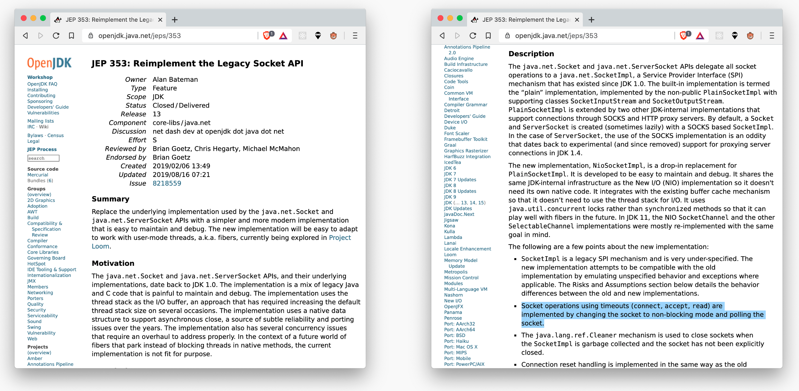

The Project Loom is a project of the JDK team to implement virtual ("green") threads on the Java platform.
In the Java world the classic thread-per-request model is still very common. In this model, a separate thread is started on a Web server for each incoming request to process the request. This "blocking" of the thread is done to "pretend" that an operation (e.g. reading a network socket) is synchronous. However, since operating system threads are relatively heavy, they are generally a limited resource and often the first bottleneck that prevents a machine from processing more requests per time unit.
To get around this bottleneck, non-blocking APIs are used which do not block the thread. In Node.JS or Vertx, an event loop execution model is used, which encapsulates the asynchrony of operations, which can now be managed directly by the consumer, via callbacks or futures. However, the Project-Loom developers choose a different approach: non-blocking APIs are encapsulated by existing (synchronous) Java APIs and made "virtual-thread-ready" by blocking the virtual threads until the desired operation is completed. Thus, the synchronicity of the call is simulated at the virtual thread level, just as the operating system does with blocking syscalls with "real" threads. The semantics of the interface remain the same and therefore no changes on the consumer side are necessary.

*Figure: Virtual threads to translate asynchronous APIs into synchronous ones*

How exactly is such a virtual thread implemented in Project Loom? A virtual thread is represented by a so-called continuation. This is a piece of sequential code that can suspend itself (e.g. when waiting for an external resource) and can be continued at a later time. These continuations are executed by the JVM on real operating system threads ("carrier threads") in sequence using a (configurable) scheduler.
As a major advantage of virtual threads over the event loop approach, the JVM promises to take advantage of the modern and efficient world of non-blocking APIs without changing its familiar thread-per-request programming model, and ideally to benefit from these changes without code changes from existing code bases. Existing interfaces are not broken and the necessary changes happen "under the hood".

*Figure: JEP 353: Preparation of the Socket API for virtual thread readiness*

It is also not necessary, as for example in Javascript, to split its code into two worlds (synchronous/asynchronous) (the so-called Blue/Red-World problem).

*Figure: Symptom of the Blue/Red-World problem in node.js: The same functionality must be provided in both variants (synchronous/asynchronous)

Preview builds of Project Loom are available at [https://jdk.java.net/loom/]. At first glance you won't see much change, because we try to reuse the existing thread APIs for virtual threads as much as possible.

Ideally, the end user of a framework won't notice much, but will benefit from it bit by bit when virtual thread support is arriving in frameworks and libraries. Whether it is really possible to reuse as much code without changes as the Project-Loom developers had in mind will become apparent over time.

