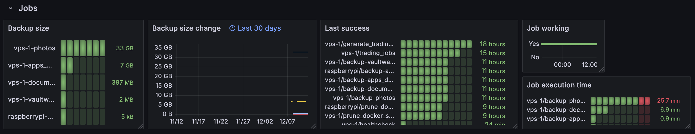

## The Quest for Simplicity

For some time now, I've been on the lookout for a lightweight solution to handle periodic tasks on servers. These tasks range from backups and system maintenance to application-specific jobs. Here's what I need:
- Execute scripts periodically
- Monitor job status (working/not working, last execution time)
- Output Prometheus-compatible metrics for Grafana integration
- Allow custom metrics from jobs, like size of a backup for a backup job
- A secure way to pass sensitive information to scripts (nice to have)

## Previous Attempts

I tried several approaches before settling on my current solution:
- **Plain Cron**: Simple but limited monitoring capabilities, monitoring success and failures was cumbersome.
- **[Windmill](https://windmill.dev/)**: While it worked well and covers all of my needs, it felt too heavyweight for my needs. Especially when thinking about running this service on every server in my network.
- **[Ofelia](https://github.com/mcuadros/ofelia)** which is a docker based cron manager. I tried it because it is docker based, and you can define jobs via Docker labels, which suits my use-case, because I run all services in Docker. It only worked for basic job but and was too limited in the end.

## My Solution

I ended up creating a two-component system:

### 1. Job Wrapper Script

A simple Python script (`job-wrapper.py`) that:

- Executes each job with given parameters.
- Measures execution time and success status.
- Writes metrics to a designated folder, handling the basic state management needed (e.g. to remember the timestamp when each job was executed successfully).
- Provides an environment variable for jobs to output custom metrics.
- Has no external dependencies and can be executed in an vanilla Linux environment.

### 2. Scheduling with builtin services

I opted for `systemd` over cron, because it also gives you logging for free, since I am already collecting the journal output to my Loki instance.

Here's how a job is run (inside a systemd unit):

```bash
/usr/bin/env python3 /apps/services/job-wrapper/job-wrapper.py backup-photos /apps/services/job-backup/backup.sh ssh://my-storage-box:23/./vps-1-photos /media/data/photos
```

The job is also given a name (the first parameter to the `job-wrapper.py`), which is used for writing the metric files and as metric labels.

## Visualizing and Alerting

I use `alloy` to collect the metric files from the output folder using the [Unix exporter](https://grafana.com/docs/alloy/latest/reference/components/prometheus/prometheus.exporter.unix/). Each job will produce one or more metric files.

The cool thing is that once the Grafana dashboard is up and running, all jobs you define are automatically picked up and displayed.

Everything gets displayed in Grafana. Here's what I monitor:
- Time since last successful run, also with alerts in case important jobs do not execute for a specific period.
- Success status of the last execution.
- Execution duration, to ensure jobs aren't hanging or becoming inefficient.




### How custom metrics work

The job wrapper passes a `JOB_METRICS_FILE` environment variable to the job, where custom metrics can be written.

For my backup jobs using Borg (a deduplicating backup program), I output the backup size, which is then automatically picked up and can be visualized in Grafana:

```bash
cat > $JOB_METRICS_FILE << EOF
# HELP job_backup_size_bytes Size of the backup in bytes
# TYPE job_backup_size_bytes gauge
job_backup_size_bytes{borg_repo="$BORG_REPO"} $BACKUP_SIZE
EOF
```

### Server healthcheck

When the server is totally down, I won't get any alerts from Grafana. So I use another job to which does a curl every 30 minutes to `healthchecks.io`. I will get an  through healthchecks.io if there's a missed check.

## Conclusion

This setup perfectly suits my needs because it:

- Uses existing system components (systemd and Python) which makes it lightweight and simple.
- Provides reliable job execution and monitoring.
- New jobs are automatically displayed in Grafana.
- If I need additional features, I only need to modify the job wrapper script.

The only missing piece is a proper secret management solution. I'm considering using systemd credentials (https://systemd.io/CREDENTIALS/) for this purpose, please reach out if you have a better idea.
