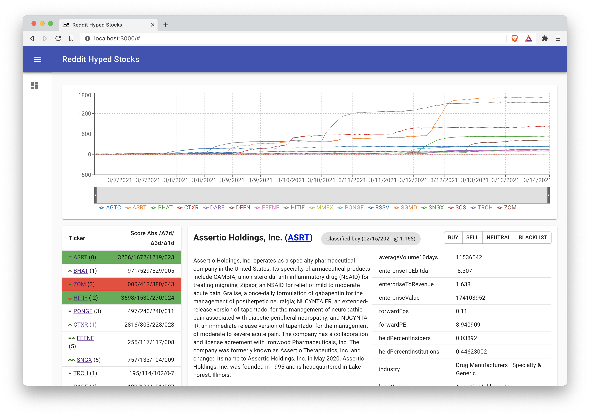

With Reddit Hyped Stocks you can explore currently hyped stocks on certain subreddits.

It shows a chart of the most hyped stock tickers on Reddit. Additionally, a detail view displays detailed information of a chosen company including the descriptions and selected key figures, which is queried live from Yahoo Finance. You can classify stocks as "buy" or "sell" to keep track of them.

Currently, you have to run a script to collect the raw data from reddit periodically, for test purposes you can use the example data provided in the Repo. 

To use it, you need Docker installed (or Python + Node.JS to setup a Dev environment).

Check out the application, and a detailed description at Github https://github.com/lukstei/reddit-hyped-stocks

