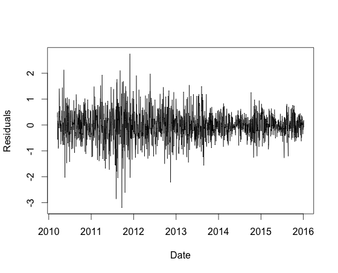
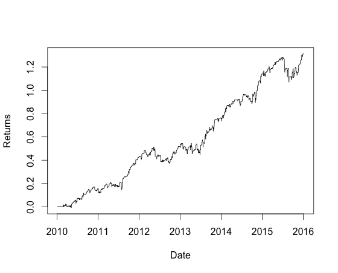

### The cointegration trading strategy implemented in Java

I've recently wrapped up a personal project, a lightweight backtesting engine for stock trading strategies written in Java. I built it to explore certain algorithmic trading concepts.

The primary motivation for this project was to explore a particular strategy: *cointegration trading*, often referred to as pairs trading. This approach involves identifying pairs of stocks whose prices tend to move together over time, even if they occasionally diverge.

The approach is:

1. Build a linear model to find the optimal hedge ratio between two stocks, trying to set Pa = alpha + beta * Pb, where Pa is the price of stock A and Pb is the price of stock B.
2. Use a Kalman filter as a dynamic Bayesian model to estimate alpha and beta. 
3. After estimating the parameters, compute the residuals: residuals = Pa - alpha - beta*Pb.
4. When the last residual differs from 0 by a given threshold, take a short position in stock A and a long position in stock B, weighted by a fixed n and the parameter beta.

Most interestingly, the cointegration strategy uses the Kalman filter not just as a filter, but as a dynamic linear regression. It's a clever way to constantly adjust the relationship (alpha and beta) between two assets as new price data comes in. This is something you don't see very often because Kalman filters are usually used to denoise a system, not to model a linear regression. The fact that we use the error as a trigger for the trading strategy makes it even more interesting.

Instead of looking at price levels, it looks at the *residuals* from the cointegration model. This is great because it's the deviation from the expected relationship that triggers the trading decisions. It's a different way of thinking than typical moving average crosses or RSI indicators.

Note that the parameters of the cointegration model must be calibrated and require an understanding of how the Kalman filter works. These parameters control how much the filter is "allowed" to change the estimated relationship in each step. These small values indicate that you want the algorithm to be quite stable, and therefore the output should not change much with each new price value, i.e. the linear model should not fluctuate much from one iteration to the next. This is critical to avoid overfitting the data.

This strategy can be quite interesting, and is described in *Algorithmic Trading: Winning Strategies and Their Rationale* by Ernie Chan.

## Example execution with GLD and GDX
 
This strategy is often demonstrated on GLD and GDX because gold miners' profitability and stock prices are strongly influenced by the price of gold, causing their prices to move together over time.
When executing the sample strategy, the engine outputs orders and trading statistics in CSV format, so you can use tools like R to analyze the data.

The return curve and residuals plot using R looks like this:

Check out the code on [GitHub](https://github.com/lukstei/trading-backtest).

